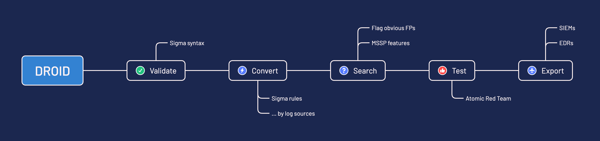

# droid

`droid` is a PySigma wrapper allowing an easy adoption of [Sigma](https://sigmahq.io/) and helps enabling Detection-As-Code. The ultimate goal of `droid` is to consume a repository Sigma rules and deploy them on one or multiple platform (SIEM/EDR). The tool also supports plain SIEM/EDR search queries.

## 🚀 Features

Key features are:

1. **Validate** the syntax of Sigma rules
2. **Convert** them by applying a set of transforms per log source and platform
3. **Search** in logs and report on findings
4. **Test** the rules by leveraging Atomic Red Team™ (work in progress)
5. **Deploy** them with any compatible SIEM and EDR (.e.g. Splunk, Microsoft Sentinel)

## 🚂 Get started

To get started with the tool, visit the [documentation page](https://certeu.github.io/droid-docs/getting-started/) and configure `droid` for your environment.

## 📚 Resources

- [Sigma Unleashed: A Realistic Implementation](https://www.first.org/resources/papers/conf2024/1315-1350-Sigma-Unleashed-Mathieu-Le-Cleach.pdf)

## License

Licensed under the EUPL.
